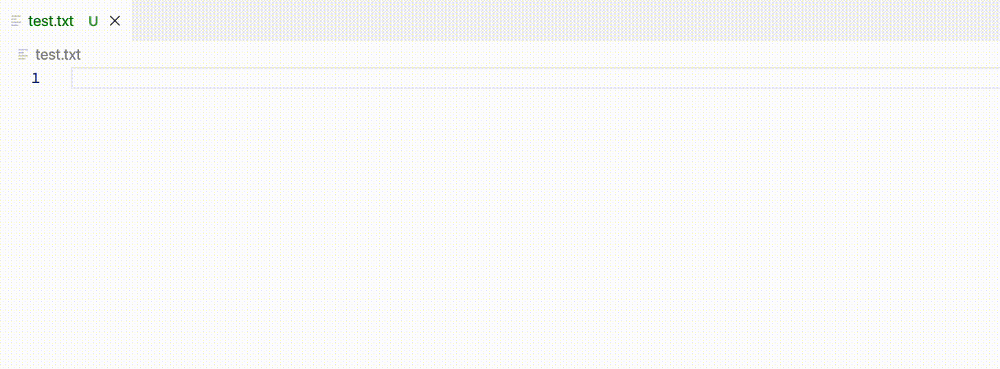

# vscode-language-server-template 補完機能版 README

"vscode-language-server-template"を用いた補完機能を作成します。

## 機能

* 補完機能
* TODO: 設定を反映した補完機能

## 設定

本拡張機能は以下を[設定](https://code.visualstudio.com/docs/getstarted/settings)可能です:

* `sampleserver.comletionitems`: 補完する単語リストを管理する。標準では`VS Code`, `Visual Studio Code`になっています。
